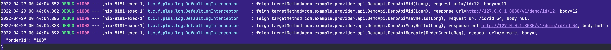

# feign-plus

A better feign client library to combine with `SpringBoot`.

---


Write [Feign](https://github.com/OpenFeign/feign) client with `annotation`, like this:

We can provider an interface.

```java
@RequestMapping("/v1/demo")
@FeignPlusClient(name = "demo", url = "${feign.demo.url}", port = "${feign.demo.port}")
public interface DemoApi {
    @GetMapping("/id")
    String sayHello(@RequestParam(value = "id") Long id);

    @GetMapping("/id/{id}")
    String id(@PathVariable(value = "id") Long id);

    @PostMapping("/create")
    Order create(@RequestBody OrderCreateReq req);

    @GetMapping("/query")
    Order query(@SpringQueryMap OrderQueryDTO dto);
}
```

Now we can use it as we normally use `SpringBoot`.

```java
@SpringBootApplication
@EnableFeignPlusClients(basePackages = "com.example.provider.api")
@RestController
public class DemoApplication {

	@Resource
	private DemoApi demoApi;

	@GetMapping(value = "/hello")
	public String hello() {
		demoApi.id(12L);
		demoApi.sayHello(34L);
		demoApi.create(new OrderCreateReq("100"));
		demoApi.query(new OrderQueryDTO("999", "zhangsan"));
		return "hello";
	}

	public static void main(String[] args) {
		SpringApplication.run(DemoApplication.class, args);
	}

}
```

# Feature

- [x] Request/Response/Exception log record.
- [x] Custom interceptor.
- [x] Micrometer support.
- [x] Exception passing.


## Interceptor 
By default, the request log is logged using the debug level.


For custom interceptor you need to create a bean that extends the DefaultLogInterceptor. 

**Example usage:**
```java
@Component
@Slf4j
public class CustomFeignInterceptor extends DefaultLogInterceptor {
    @Override
    public void request(String target, String url, String body) {
        super.request(target, url, body);
        log.info("request");
    }

    @Override
    public void exception(String target, String url, FeignException feignException) {
        super.exception(target, url, feignException);
    }

    @Override
    public void response(String target, String url, Object response) {
        super.response(target, url, response);
        log.info("response");
    }
}
```


# More configuration

```yaml
feign:
  plus:
    connect-timeout: 11000
    max-idle-connections: 520
    read-timeout: 12000
```